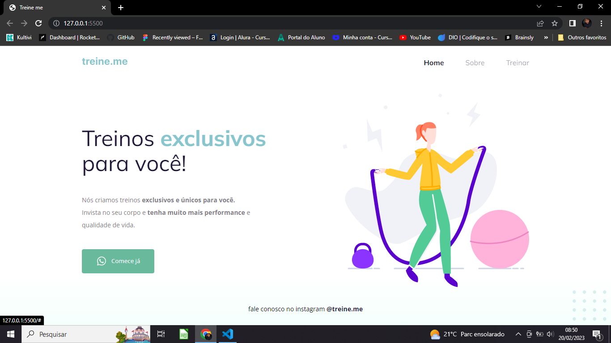

<h1 align="center">Corrigindo bugs (02) 👀</h1>

# 💻 Sobre o desafio

Nesse desafio, recebi um código com o projeto desenvolvido durante as aulas da Fase 02.
Mas, a surpresa vem aí...  **👀**  
O código sofreu algumas alterações e, como podemos ver na imagem abaixo, ele não está mais da mesma forma que o Maykão deixou no Figma.

  <a href="#-tecnologias">Tecnologias</a>&nbsp;&nbsp;&nbsp;|&nbsp;&nbsp;&nbsp;
  <a href="#-projeto">Projeto</a>&nbsp;&nbsp;&nbsp;|&nbsp;&nbsp;&nbsp;
  <a href="#-layout">Layout</a>&nbsp;&nbsp;&nbsp;|&nbsp;&nbsp;&nbsp;

 
Antes da refaturação do código, o projeto se encontrava assim:
 
 

  

 

 
Após a refaturação, seguindo as orientações do Figma, o projeto ficou assim:
 
 

  

## 🚀 Tecnologias

Esse projeto foi desenvolvido com as seguintes tecnologias:
- Figma
- HTML e CSS
- Git e Github
- VS Code

## 💻 Projeto

Pagina para agendaentos de treinos

## 🔖 Layout

Você pode visualizar o layout do projeto através [DESSE LINK](https://www.figma.com/file/YRb9B9zEPs5p3TwWb4PMQ0/Explorer---Projeto-02-(Copy)?node-id=0%3A1&t=sgl5g0Im69puIWFj-0). É necessário ter conta no [Figma](https://figma.com) para acessá-lo.

